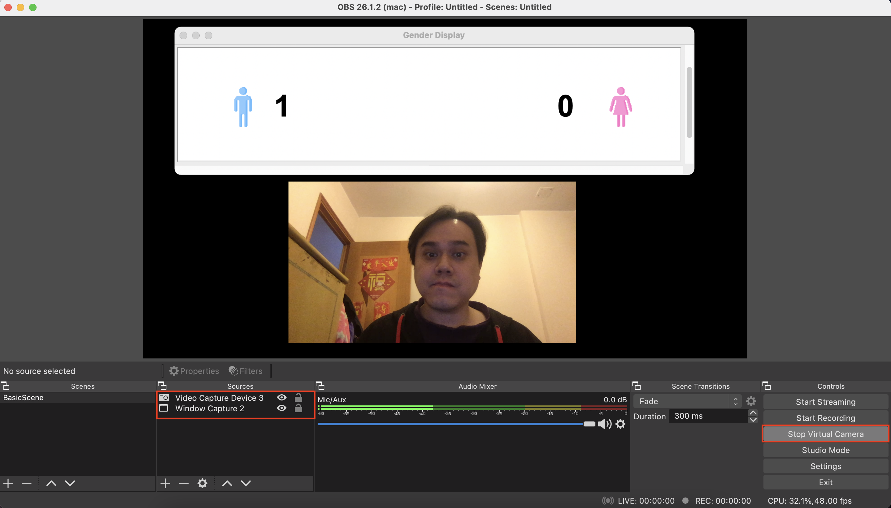
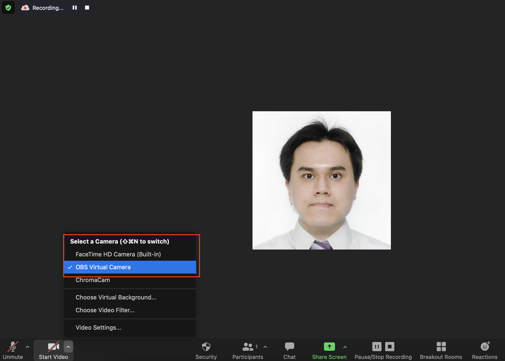
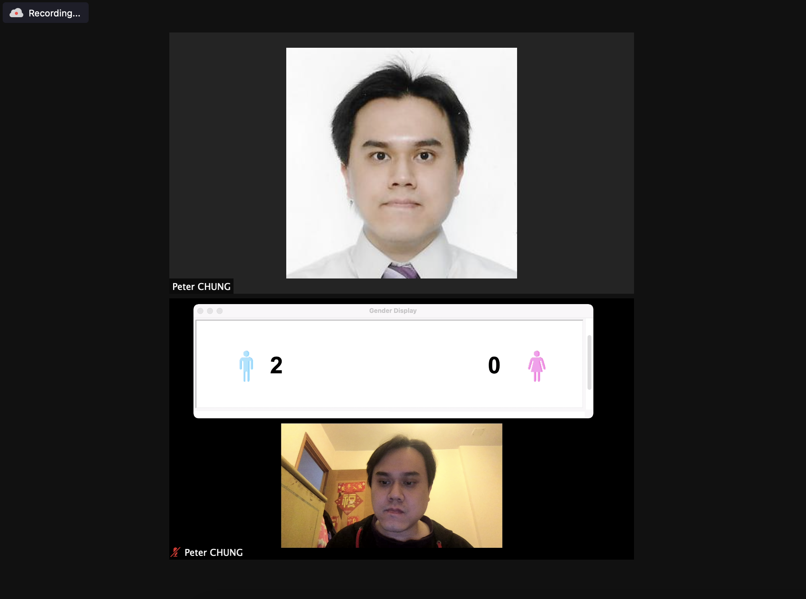
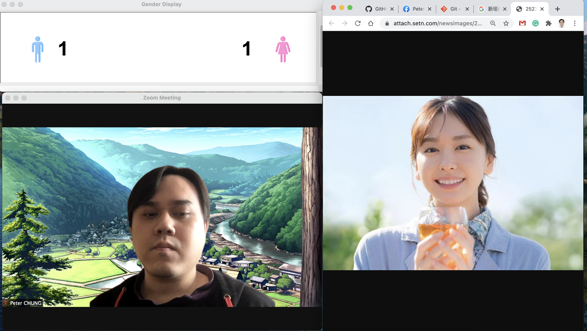
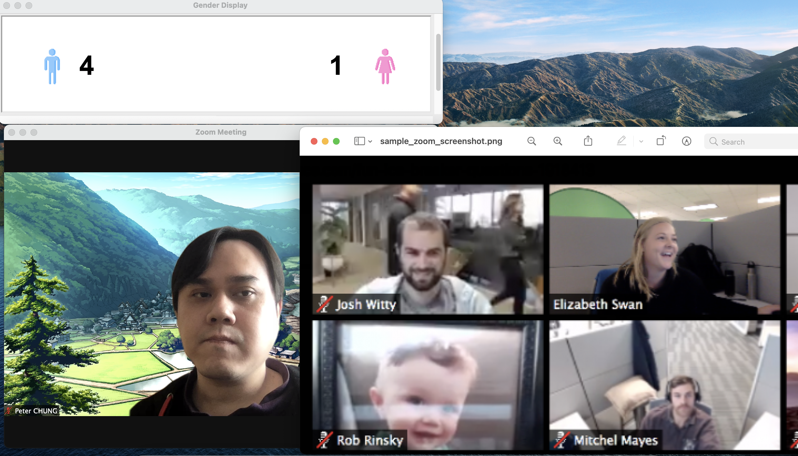

# face_gender
Simple face gender detection for an online meeting, modified based on [face-emotion](https://github.com/DeepSE/face-emotion)


## How to run the program?
```bash
pip install -r requirements.txt
python main.py
```

## How to use in the Zoom meeting

Step 1 - Install `OBS` and set up a virtual camera

- Add a video capture device
- Add a Window capture and select the program window
- `Start Virtual Camera` (bottom-right corner)
    - Once the virtual camera is started, the button text becomes `Stop Virtual Camera`




Step 2 - Open Zoom and select the virtual camera 

- Remember, you should select the `OBS Virtual Camera` (instead of your default webcam)



Step 3 - Select Gallery View in Zoom

- The application will keep detecting faces (per 1 second by default) 
- The update frequency can be adjusted in `main.py`)




## Recommendations on setting up the Python environment

- To avoid polluting the Python environment, please consider to use `venv` in Python 
    - [Python virtual environment tutorial](https://docs.python.org/3/tutorial/venv.html)
- You should also setup `pyenv`
    - For some reason, installing Python via `pyenv` does not support `Tcl/Tk` by default
    - This application needs `Tcl/Tk` support, you need to follow this [stackoverflow discussion](https://stackoverflow.com/questions/60469202/unable-to-install-tkinter-with-pyenv-pythons-on-macos) in order to install a Python environment with `Tcl/Tk` support

### Demo screenshots

Example 1 - Only 1 male on the screen


Example 2 - 1 male and 1 female on the screen 



Example 3 - Multiple people on the screen

- Note: The sample Zoom screenshot is downloaded from the web




